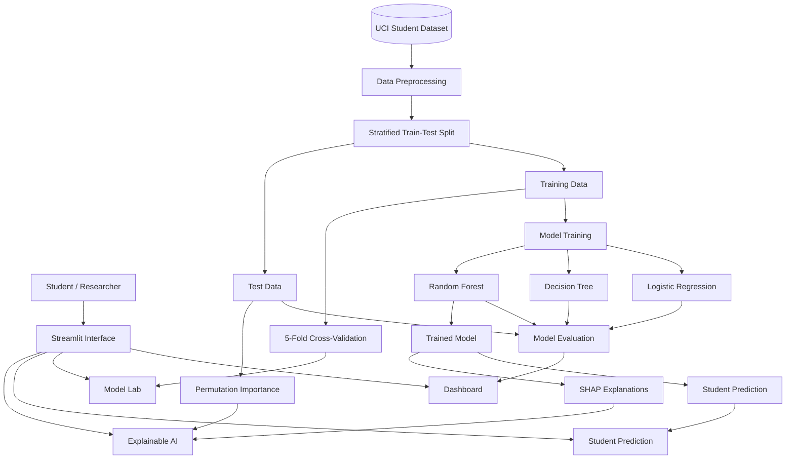

# EduPredict — System Architecture

```mermaid
flowchart TB
    A["Student / Researcher"] --> B["Streamlit Interface"]

    B --> C["Dashboard"]
    B --> D["Model Lab"]
    B --> E["Student Prediction"]
    B --> F["Explainable AI"]

    G[("UCI Student Dataset")] --> H["Data Preprocessing"]
    H --> I["Stratified Train-Test Split"]

    I --> J["Training Data"]
    I --> K["Test Data"]

    J --> L["Model Training"]
    L --> M["Logistic Regression"]
    L --> N["Decision Tree"]
    L --> O["Random Forest"]

    M --> P["Model Evaluation"]
    N --> P
    O --> P
    K --> P

    J --> R["5-Fold Cross-Validation"]
    O --> S["Trained Model"]

    S --> T["Student Prediction"]
    S --> U["SHAP Explanations"]
    K --> V["Permutation Importance"]

    P --> C
    R --> D
    T --> E
    U --> F
    V --> F
```
